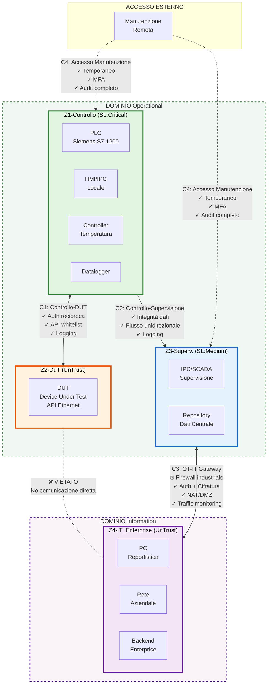

## Analisi Formale dei GAP secondo IEC 62443

### 1. Scopo del Documento

Questo documento fornisce un'analisi formale dei GAP dell'architettura attuale AS-IS
del test bench industriale rispetto ai requisiti dello standard IEC
62443.

L'obiettivo è:

- Definire lo scope del sistema valutato
- Identificare zone e condotti
- Determinare il Security Level Target (SL-T)
- Valutare l'Actual Security Level (SL-A)
- Identificare i gap rispetto ai Foundational Requirements IEC 62443-3-3
- Evidenziare i controlli programmatici mancanti (IEC 62443-2-1)
- Identificare i gap a livello di componente (IEC 62443-4-2)

Questo report è strutturato in allineamento con la metodologia di assessment
IEC 62443.

### 2. Spiegazione dei Termini Chiave di IEC 62443

Per chiarezza, le seguenti abbreviazioni e concetti sono utilizzati in questo documento secondo la terminologia IEC 62443.

#### 2.1 Livelli di Sicurezza (Security Levels)

**SL (Security Level)**

Un livello definito di resistenza contro un profilo di minaccia definito. La norma IEC 62443 definisce quattro Security Levels (SL 1-4), ciascuno corrispondente a un profilo di attaccante con crescenti capacità, motivazione e risorse.

**SL-T (Target Security Level)**

Il Security Level richiesto per il sistema, determinato attraverso un risk assessment formale secondo IEC 62443-3-2. L'SL-T rappresenta il livello di protezione necessario basato sull'analisi delle minacce, delle vulnerabilità e dell'impatto potenziale.

**SL-A (Achieved or Actual Security Level)**

Il Security Level attualmente raggiunto dal sistema nella sua configurazione AS-IS. L'SL-A rappresenta il livello effettivo di protezione implementato, misurato rispetto ai Foundational Requirements.

**SL-C (Capability Security Level)**

Il Security Level che i componenti del sistema sono in grado di raggiungere quando adeguatamente configurati e integrati. L'SL-C rappresenta la capacità intrinseca dei componenti, indipendentemente dalla loro configurazione attuale.

#### 2.2 Foundational Requirements (FR)

**FR (Foundational Requirement)**

Una delle sette categorie di requisiti di sicurezza di alto livello definite in IEC 62443-3-3. Ogni FR rappresenta un obiettivo di sicurezza fondamentale che deve essere soddisfatto per raggiungere un determinato Security Level.

Le sette categorie FR sono:

- **FR1** -- Identification and Authentication Control (IAC)
- **FR2** -- Use Control (UC)
- **FR3** -- System Integrity (SI)
- **FR4** -- Data Confidentiality (DC)
- **FR5** -- Restricted Data Flow (RDF)
- **FR6** -- Timely Response to Events (TRE)
- **FR7** -- Resource Availability (RA)

#### 2.3 Zone e Conduits (IEC 62443-3-2)

La norma IEC 62443-3-2 introduce il modello **Zone & Conduits** come approccio fondamentale per la segmentazione e il controllo dei flussi di comunicazione nei sistemi di automazione e controllo industriale (IACS).

##### 2.3.1 Definizione di Zona

**Zona (Zone)**

Secondo IEC 62443-3-2, una **zona** è definita come:

> *"Un raggruppamento di asset logici o fisici che condividono requisiti di sicurezza comuni"*

Caratteristiche di una zona:

- **Omogeneità dei requisiti**: tutti gli asset in una zona hanno lo stesso Security Level Target
- **Perimetro definito**: confini chiari che separano la zona da altre zone e dall'esterno
- **Controllo degli accessi**: tutti i flussi di comunicazione in ingresso/uscita sono controllati
- **Policy di sicurezza comune**: regole uniformi applicate a tutti gli elementi della zona

Principi di definizione delle zone:

- Funzionalità comune (es. controllo, supervisione, dati)
- Livello di criticità equivalente
- Requisiti di disponibilità, integrità e confidenzialità simili
- Appartenenza allo stesso dominio operativo (OT) o informativo (IT)

##### 2.3.2 Definizione di Conduit

**Conduit (Condotto)**

Secondo IEC 62443-3-2, un **conduit** è definito come:

> *"Un canale di comunicazione logico tra due o più zone che è monitorato e controllato"*

Caratteristiche di un conduit:

- **Controllo esplicito**: ogni conduit implementa policy di sicurezza specifiche
- **Monitoraggio**: il traffico sul conduit è ispezionato e registrato
- **Autenticazione**: verifica dell'identità delle entità comunicanti
- **Autorizzazione**: controllo delle operazioni permesse attraverso il conduit
- **Integrità**: protezione contro manipolazione dei dati in transito
- **Confidenzialità**: protezione dei dati sensibili tramite cifratura (dove richiesto)

Tipi di conduit comuni:

- **Firewall industriale**: filtraggio stateful o deep packet inspection
- **Data diode**: comunicazione unidirezionale fisica
- **VPN/Tunnel cifrato**: protezione dei dati su reti non trusted
- **Gateway protocollo**: traduzione e controllo tra protocolli diversi

##### 2.3.3 Principi di Segmentazione secondo la Norma

La norma IEC 62443-3-2 stabilisce i seguenti principi guida per la segmentazione:

**1. Defense in Depth**

Implementare controlli multipli e stratificati. La compromissione di un singolo controllo non deve compromettere l'intero sistema.

**2. Least Privilege**

Ogni zona e ogni conduit deve garantire solo il minimo accesso necessario per le funzioni operative legittime.

**3. Separation of Concerns**

Separare funzionalmente e logicamente:

- Domini OT (Operational Technology) da domini IT (Information Technology)
- Funzioni di controllo da funzioni di supervisione
- Sistemi critici da sistemi non critici
- Entità trusted da entità non trusted

**4. Explicit Deny (Default Deny)**

Tutto ciò che non è esplicitamente permesso deve essere vietato. La politica predefinita è il rifiuto dell'accesso.

**5. Monitoraggio e Visibilità**

Ogni flusso di comunicazione tra zone deve essere monitorabile e tracciabile per supportare detection e response.

**6. Scalabilità e Manutenibilità**

Il modello deve essere documentato, comprensibile e gestibile nel ciclo di vita del sistema.

##### 2.3.4 Benefici del Modello Zone & Conduits

- **Riduzione della superficie d'attacco**: limitazione dei punti di ingresso
- **Contenimento**: limitazione della propagazione laterale in caso di compromissione
- **Tracciabilità**: visibilità sui flussi di comunicazione critici
- **Compliance**: facilita la dimostrazione di conformità ai requisiti normativi
- **Resilienza**: isolamento dei guasti e degli attacchi in zone specifiche

### 3. Definizione del Sistema (IEC 62443-3-2)

#### 3.1 Asset Identificati (AS-IS)

- PLC (Siemens S7-1200)
- HMI locale
- Controllore di temperatura (stand-alone)
- Datalogger stand-alone
- DUT (Device Under Test) con capacità API Ethernet
- Catena relè di sicurezza (non rilevante dal punto di vista cyber ma critica per la sicurezza)
- Postazione operatore (creazione report offline)

Non esiste un'architettura di rete OT formalmente definita nella configurazione
AS-IS.

#### 3.2 Modello Preliminare di Zone (Concettuale)

Il seguente modello identifica le zone concettuali del sistema, che costituiranno la base per il modello formale Zone & Conduits descritto in dettaglio nella sezione FR5.

##### Zona Z1 -- Zona di Controllo Base

- PLC (Siemens S7-1200)
- HMI locale
- Controllore di temperatura
- Datalogger

##### Zona Z2 -- Zona DUT

- Dispositivo DUT
- Interfaccia Ethernet

##### Zona Z3 -- Zona Supervisiva (TO-BE)

- IPC / SCADA
- Repository dati centrale

##### Zona Z4 -- Zona IT Enterprise

- PC per reportistica
- Rete aziendale

##### Stato attuale dei condotti

I condotti in AS-IS sono principalmente fisici/manuali (USB, SD, cavo Ethernet diretto).
Nessun condotto logico o segmentazione di rete sono formalmente definiti.

::: {custom-style="b-note"}
**Nota:** Il modello formale completo con definizione dettagliata delle zone, dei conduits (C1-C4), delle regole di flusso e dei requisiti di sicurezza è presentato nella sezione **FR5 – Restricted Data Flow**.
:::

##### 3.2.3 Vista d'Insieme: Diagramma Zone & Conduits

Il seguente diagramma fornisce una rappresentazione visuale complessiva del modello di segmentazione Zone & Conduits per il sistema Industrial Test Bench secondo IEC 62443-3-2.

I dettagli implementativi completi di ciascuna zona e conduit, inclusi i controlli di sicurezza specifici e i requisiti SL2 associati, sono approfonditi nella sezione FR5 (§5.5).

**Legenda del Diagramma:**

- **Domini**: Separazione logica tra Operational Technology (OT) e Information Technology (IT)
- **Zone (Z1-Z4)**: Raggruppamenti di asset con requisiti di sicurezza comuni
  - **Z1 (Controllo)**: Zona critica con PLC, HMI, sensori e attuatori
  - **Z2 (DUT)**: Device Under Test, considerato potenzialmente non trusted
  - **Z3 (Supervisione)**: Sistema di supervisione e storage dati
  - **Z4 (IT Enterprise)**: Rete aziendale e backend
- **Conduits (C1-C4)**: Canali di comunicazione controllati tra zone
  - **Frecce solide** (↔): Comunicazione bidirezionale controllata
  - **Frecce tratteggiate** (⋯→): Accesso temporaneo/occasionale
  - **Croce rossa** (✗): Comunicazione esplicitamente vietata
- **Simboli di controllo**:
  - ✓ Controlli di sicurezza implementati
  - 🔥 Firewall/Gateway di sicurezza
  - ❌ Divieto esplicito di comunicazione

**Principi applicati:**

1. **Separation of Concerns**: Separazione netta OT/IT e controllo/supervisione
2. **Default Deny**: Comunicazione Z2↔Z4 esplicitamente vietata
3. **Least Privilege**: Ogni conduit implementa solo i flussi strettamente necessari
4. **Defense in Depth**: Controlli multipli su ogni conduit (autenticazione + autorizzazione + logging)

### 4. Determinazione del Security Level Target

Basato su:

- Esposizione dell'ambiente industriale
- Probabilità moderata di abuso o manomissione
- Presenza di implicazioni di sicurezza
- Nessun modello di minaccia avanzato nation-state

Il Security Level Target raccomandato è:

#### SL-T = 2

SL2 fornisce protezione contro:

- Violazioni intenzionali utilizzando mezzi semplici
- Attaccanti con risorse limitate
- Malware generico
- Scenari di abuso da parte di insider

### 5. IEC 62443-3-3 Foundational Requirement Assessment e Requisiti TO-BE

#### FR1 -- Identification & Authentication Control (IAC)

##### Stato AS-IS

- Nessuna autenticazione strutturata su PLC/HMI
- Nessuna identità utente unica
- Autenticazione API DUT non definita

##### Requisiti SL2

- ID utente univoci
- Meccanismi di autenticazione robusti
- Controllo e gestione delle sessioni

##### Valutazione

- SL-A ≈ 0
- Gap Severity: **Alto**

##### Implicazioni Architetturali TO-BE

- Implementazione di un sistema di autenticazione su HMI/IPC
- Introduzione di identità per-device per comunicazioni verso backend
- Gestione controllata delle sessioni (timeout, rinnovo, chiusura)
- Autenticazione delle API del DUT con credenziali dedicate
- Meccanismi di strong authentication (es. password policy, multi-factor dove applicabile)

#### FR2 -- Use Control (UC)

##### Stato AS-IS

- Nessun controllo accessi basato sui ruoli
- Nessuna separazione dei privilegi
- Accesso completo a tutte le funzioni per chiunque

##### Requisiti SL2

- Controllo accessi basato sui ruoli (RBAC)
- Principio del minimo privilegio
- Enforcement dei diritti di accesso

##### Valutazione

- SL-A ≈ 0
- Gap Severity: **Alto**

##### Implicazioni Architetturali TO-BE

- Definizione di un modello RBAC esplicito con ruoli:
  - **Operatore**: avvio test, supervisione, lettura dati
  - **Manutentore**: diagnostica, configurazione parametri non critici
  - **Amministratore**: gestione sistema, configurazioni di sicurezza
- Enforcement applicativo dei privilegi a livello HMI/IPC
- Separazione tra funzioni operative e funzioni di configurazione
- Logging degli accessi privilegiati

#### FR3 -- System Integrity (SI)

##### Stato AS-IS

- Nessuna verifica di integrità firmware/software
- Nessuna gestione formale della configurazione
- Nessun processo di aggiornamento controllato
- Configurazioni modificabili senza tracciabilità

##### Requisiti SL2

- Protezione contro modifiche non autorizzate
- Meccanismi di garanzia dell'integrità
- Procedure di aggiornamento controllate e verificabili

##### Valutazione

- SL-A ≈ 0
- Gap Severity: **Alto**

##### Implicazioni Architetturali TO-BE

- Introduzione di **Root of Trust** a livello hardware/firmware
- Implementazione di **Secure Boot** con verifica crittografica delle immagini
- Meccanismo di aggiornamento firmware autenticato e firmato digitalmente
- Protezione dell'integrità delle configurazioni critiche (checksum, firma)
- Versioning formale delle configurazioni
- Meccanismi di rollback controllato in caso di corruzione
- Protezione anti-tampering per parametri di sicurezza

#### FR4 -- Data Confidentiality (DC)

##### Stato AS-IS

- Dati memorizzati in CSV in chiaro
- Nessuna crittografia dei dati sensibili
- Media rimovibili (USB/SD) non controllati
- Nessuna classificazione dei dati

##### Requisiti SL2

- Protezione dei dati sensibili in transito e a riposo
- Crittografia dove necessario
- Controllo dell'accesso ai dati

##### Valutazione

- SL-A ≈ 0
- Gap Severity: **Medio**

##### Implicazioni Architetturali TO-BE

- **Classificazione dei dati** per livello di sensibilità:
  - Dati di processo pubblici (temperature, pressioni aggregate)
  - Dati sensibili (ricette, configurazioni, credenziali)
- Cifratura dei dati sensibili in transito (TLS/DTLS per comunicazioni di rete)
- Cifratura opzionale dei dati a riposo per configurazioni critiche
- Politica di gestione e controllo dei supporti rimovibili:
  - Logging degli accessi
  - Disabilitazione selettiva ove non necessario
- Protezione delle credenziali (no plaintext storage)

#### FR5 -- Restricted Data Flow (RDF)

##### Stato AS-IS

- Nessuna segmentazione di rete formale
- Nessun firewall o controllo dei condotti
- Accesso Ethernet diretto al DUT senza controlli
- Condotti fisici non controllati (USB/SD)

##### Requisiti SL2

- Zone e Conduits formalmente definiti
- Controllo dei flussi tra zone
- Segmentazione logica della rete

##### Valutazione

- SL-A ≈ 0
- Gap Severity: **Alto**

##### Implicazioni Architetturali TO-BE

###### Principi di Segmentazione

Il modello Zone & Conduits è costruito secondo i seguenti principi:

- Separazione tra dominio OT e dominio IT
- Separazione tra funzioni di controllo e funzioni di supervisione
- Isolamento del DUT (Device Under Test) come entità distinta
- Controllo esplicito di ogni flusso dati tra domini
- Assunzione che ogni zona sia non trusted rispetto alle altre

La segmentazione è sia logica (VLAN, firewall, ACL) che fisica dove necessario.

###### Definizione delle Zone

####### Zona Z1 – Controllo

Comprende:

- PLC (Siemens S7-1200)
- IPC / HMI locale
- Controllore di temperatura
- Datalogger

Caratteristiche:

- Funzione critica per l'operatività del sistema
- Elevato impatto in caso di compromissione
- Accesso limitato a personale autorizzato

Requisiti SL2 associati: FR1 (autenticazione utenti), FR2 (RBAC), FR3 (integrità software e configurazioni), FR6 (logging eventi critici)

####### Zona Z2 – DUT (Device Under Test)

Comprende:

- Dispositivo oggetto di test
- API di comunicazione verso il sistema di controllo

Caratteristiche:

- Entità potenzialmente non trusted
- Superficie di attacco diretta tramite Ethernet

Requisiti SL2 associati: FR1 (autenticazione API), FR3 (integrità comunicazioni), FR5 (controllo flussi verso Z1)

::: {custom-style="b-note"}
Nota architetturale: Il DUT non deve poter influenzare direttamente la zona di controllo senza attraversare un conduit controllato.
:::

####### Zona Z3 – Supervisione / Storage

Comprende:

- Storage locale / repository dati
- IPC/SCADA per supervisione
- Eventuale server di supervisione futuro

Caratteristiche:

- Contiene dati di test aggregati
- Può interfacciarsi con IT aziendale

Requisiti SL2 associati: FR4 (protezione dati), FR6 (event logging e forwarding), FR5 (segmentazione verso IT)

####### Zona Z4 – IT Enterprise

Comprende:

- Rete aziendale
- PC per reportistica
- Backend enterprise
- Sistemi remoti di manutenzione

Caratteristiche:

- Considerata non trusted rispetto al dominio OT
- Accesso remoto controllato tramite gateway

Requisiti SL2 associati: FR5 (restricted data flow), FR1 (autenticazione device-server)

###### Definizione dei Conduits

Ogni comunicazione tra zone avviene esclusivamente tramite conduits definiti e controllati.

####### Conduit C1 – Z1 ↔ Z2 (Controllo-DUT)

- Protocollo controllato e autenticato
- Autenticazione reciproca device-to-device
- Limitazione delle funzioni API esposte (whitelist)
- Logging completo delle interazioni

Obiettivo: Impedire che un DUT compromesso possa compromettere la zona di controllo.

####### Conduit C2 – Z1 ↔ Z3 (Controllo-Supervisione)

- Trasferimento controllato dei dati di test
- Controllo di integrità dei dati (checksum, firma)
- Logging delle operazioni di trasferimento
- Flusso unidirezionale preferito (Z1 → Z3)

####### Conduit C3 – Z3 ↔ Z4 (Supervisione-IT)

- Firewall industriale o gateway dedicato
- Accesso remoto autenticato e cifrato
- Segmentazione rigida IT/OT
- Monitoraggio del traffico e detection anomalie
- NAT per mascheramento indirizzi OT

####### Conduit C4 – Accesso Manutenzione (esterno → Z1/Z3)

- Accesso temporaneo e limitato nel tempo
- Autenticazione forte (multi-factor dove possibile)
- Tracciabilità completa delle operazioni
- Canale dedicato isolato dal traffico operativo

###### Regole Generali sui Flussi

- **Nessuna comunicazione diretta** tra Z2 (DUT) e Z4 (IT)
- **Nessuna comunicazione non autenticata** tra zone
- Ogni flusso deve essere **esplicitamente giustificato** e documentato
- Le porte e servizi non utilizzati devono essere **disabilitati**
- **Default deny**: tutto ciò che non è esplicitamente permesso è vietato
- **Monitoraggio continuo** del traffico sui conduits per rilevare anomalie

###### Collegamento con le Foundational Requirements

Il modello Zone & Conduits rappresenta la misura architettonica primaria per:

- **FR5 (Restricted Data Flow)**: segmentazione e controllo dei flussi
- **FR1 (Authentication)**: autenticazione device-to-device sui conduits
- **FR2 (Use Control)**: enforcement dei privilegi per zona
- **FR6 (Event Logging)**: tracciabilità dei flussi tra zone
- **FR7 (Availability)**: limitazione propagazione di attacchi DoS

La segmentazione riduce la superficie d'attacco e limita la propagazione laterale in caso di compromissione.

#### FR6 -- Timely Response to Events (TRE)

##### Stato AS-IS

- Nessun logging degli eventi di sicurezza
- Nessun sistema di monitoraggio
- Nessun processo di risposta agli incidenti
- Eventi non tracciati né correlabili

##### Requisiti SL2

- Event logging degli eventi di sicurezza rilevanti
- Capacità di rilevazione e allerta
- Procedura di risposta definita

##### Valutazione

- SL-A ≈ 0
- Gap Severity: **Alto**

##### Implicazioni Architetturali TO-BE

- Implementazione di **logging locale** degli eventi critici:
  - Tentativi di autenticazione (successi e fallimenti)
  - Modifiche configurazione
  - Comandi critici inviati
  - Allarmi di sicurezza
  - Accessi ai dati sensibili
- Timestamping affidabile degli eventi (sincronizzazione tempo)
- Meccanismo di **forwarding sicuro** dei log verso sistema di supervisione/SIEM
- Protezione dell'integrità dei log (append-only, firma)
- Capacità di alerting per eventi critici (locale e remoto)
- Architettura predisposta per integrazione con processi di **incident response**
- Retention policy dei log coerente con requisiti normativi

#### FR7 -- Resource Availability (RA)

##### Stato AS-IS

- Nessuna valutazione di resilienza
- Nessuna protezione dall'esaurimento delle risorse
- Nessun meccanismo watchdog formalmente definito
- Vulnerabilità potenziale a DoS non valutata

##### Requisiti SL2

- Resilienza di base a scenari denial-of-service
- Meccanismi di protezione della disponibilità
- Recovery da condizioni anomale

##### Valutazione

- SL-A ≈ 0-1 (alcuni dispositivi hanno watchdog hardware base)
- Gap Severity: **Medio**

##### Implicazioni Architetturali TO-BE

- Introduzione di **watchdog hardware e software** su componenti critici
- Meccanismi di **timeout** su tutte le comunicazioni di rete
- **Rate limiting** su interfacce esposte (API, servizi di rete)
- Gestione controllata delle **connessioni concorrenti** (max connection limit)
- Monitoraggio delle risorse critiche (CPU, memoria, storage)
- Meccanismi di **graceful degradation** (degradazione controllata in caso di sovraccarico)
- Separazione tra traffico operativo e traffico di gestione
- Testing di resilienza a condizioni di stress/flood

### 6. Sicurezza a Livello di Componente (IEC 62443-4-2)

PLC: - Nessuna baseline di hardening documentata - Esposizione dei servizi di
default non valutata

HMI: - Nessuna policy di hardening OS - Nessuna governance delle patch

DUT: - Autenticazione API non valutata - Baseline di configurazione sicura
non definita

SL-C dei componenti non formalmente determinato.

Gap: Ciclo di vita della sicurezza dei componenti assente.

### 7. Valutazione del Programma di Sicurezza (IEC 62443-2-1)

AS-IS: - Nessuna policy di cybersecurity documentata - Nessun inventario degli
asset - Nessuna gestione delle vulnerabilità - Nessuna gestione delle patch - Nessun
piano di risposta agli incidenti - Nessun ruolo di cybersecurity definito

SL2 richiede: - Sistema formale di gestione della sicurezza - Responsabilità
definite - Revisione periodica - Formazione - Integrazione della gestione
delle modifiche

Gap: Programma di sicurezza organizzativo non implementato.

### 8. Valutazione Complessiva del Security Level

| Foundational Requirement | SL-A (Actual) | SL-T (Target) | Gap Severity |
|--------------------------|---------------|---------------|--------------|
| FR1 -- IAC               | 0             | 2             | High         |
| FR2 -- UC                | 0             | 2             | High         |
| FR3 -- SI                | 0             | 2             | High         |
| FR4 -- DC                | 0             | 2             | Medium       |
| FR5 -- RDF               | 0             | 2             | High         |
| FR6 -- TRE               | 0             | 2             | High         |
| FR7 -- RA                | 0--1          | 2             | Medium       |
| Livelo Complessivo       | 0--1          | 2             | Medium--High |

**Leggenda**

- FR1 -- Identification and Authentication Control (IAC)
- FR2 -- Use Control (UC)
- FR3 -- System Integrity (SI)
- FR4 -- Data Confidentiality (DC)
- FR5 -- Restricted Data Flow (RDF)
- FR6 -- Timely Response to Events (TRE)
- FR7 -- Resource Availability (RA)

### 9. Conclusione Esecutiva e Roadmap AS-IS → TO-BE

#### 9.1 Sintesi della Gap Analysis

La configurazione attuale del test bench industriale:

- **È fisicamente sicura ma cyber-immatura**: SL-A complessivo ≈ 0-1
- **Manca di zone e condotti definiti**: nessuna segmentazione formale
- **Non ha un modello di autenticazione o controllo accessi**: accesso non controllato
- **Manca di meccanismi di protezione dell'integrità**: no secure boot, no verifica firmware
- **Non ha monitoraggio degli eventi di sicurezza**: visibilità cyber assente
- **Non ha un programma formale di governance della cybersecurity**: processo ad-hoc

#### 9.2 Requisiti Architetturali per SL2

Per raggiungere la conformità **SL-T = 2** secondo IEC 62443, l'architettura TO-BE deve implementare quanto segue.

##### Requisiti di Sistema (IEC 62443-3-3)

- Segmentazione formale di zone e condotti con controllo dei flussi
- Sistema di identificazione e autenticazione degli utenti e dei dispositivi
- Modello RBAC con separazione dei privilegi
- Controlli di integrità del sistema (Secure Boot, firmware autenticato)
- Classificazione e protezione dei dati sensibili
- Event logging e capacità di detection/response
- Meccanismi di resilienza e protezione della disponibilità

##### Requisiti di Componente (IEC 62443-4-2)

- Hardening baseline per PLC, HMI, IPC
- Gestione sicura del ciclo di vita dei componenti
- Patch management strutturato

##### Requisiti Organizzativi (IEC 62443-2-1)

- Policy di cybersecurity documentata
- Inventario degli asset e classificazione
- Gestione delle vulnerabilità e delle patch
- Piano di risposta agli incidenti
- Ruoli e responsabilità definiti
- Programma di formazione

#### 9.3 Tracciabilità dei Requisiti

Tutti i requisiti architetturali identificati in questo documento devono essere tracciabili verso:

- **Upstream**: Foundational Requirements IEC 62443-3-3 e GAP identificati
- **Downstream**: Decisioni progettuali nel documento "Cybersecurity Architecture Definition"

La matrice di tracciabilità deve garantire che ogni gap critico (severity: High) sia indirizzato da almeno una misura architettonica nel TO-BE.

#### 9.4 Principi Guida per il TO-BE

1. **Defense in Depth**: implementare controlli multipli e complementari
2. **Least Privilege**: limitare accessi e privilegi al minimo necessario
3. **Separation of Concerns**: separare controllo processo, sicurezza funzionale e cybersecurity
4. **Secure by Design**: integrare la sicurezza fin dalla fase di progettazione
5. **Resilience**: garantire continuità operativa anche in presenza di eventi cyber

**Questa analisi GAP costituisce la Requirement Baseline formale per la migrazione strutturata verso la conformità IEC 62443 SL2.**

Il documento successivo "Cybersecurity Architecture Definition – Risk-Informed Baseline for Embedded Industrial Systems" tradurrà questi requisiti in decisioni architetturali concrete.
