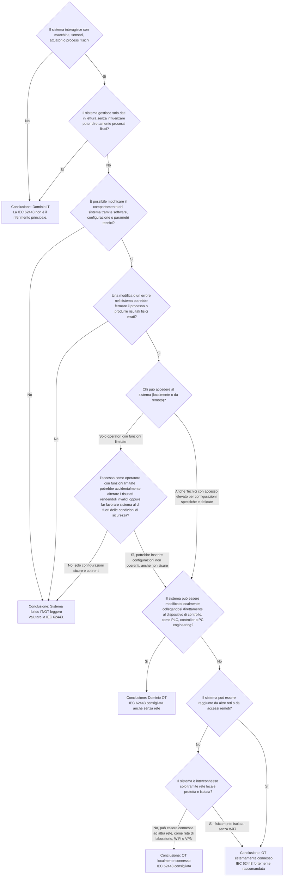

# Albero decisionale IEC 62443

Di seguito trovi il diagramma Mermaid con la ramificazione dei nodi decisionali per capire se un sistema ricade nel dominio della IEC 62443.

## Note di lettura

- Se il sistema **controlla il mondo fisico** e **può essere modificato tramite software o configurazione**, entri molto probabilmente nel dominio OT.
- La presenza di **accessi locali** al PLC, al controller o alla workstation engineering è già rilevante. Non serve che l'accesso sia remoto.
- La presenza di **rete o accessi remoti** rende la IEC 62443 ancora più importante, ma non è la condizione minima per la sua rilevanza.

## Spiegazione dei nodi dell'albero decisionale IEC 62443

Di seguito viene spiegata la motivazione tecnica dietro ogni nodo decisionale dell’albero.  
Lo scopo di queste domande è capire **quando un sistema entra nel dominio della cybersecurity OT**, cioè il dominio trattato dalla norma **IEC 62443**.

Ogni nodo evidenzia:

- quale rischio si sta cercando di individuare
- perché quel rischio è rilevante
- perché porta o meno verso l'adozione della IEC 62443.

### Domanda 1

**Il sistema interagisce con macchine, sensori, attuatori o processi fisici?**

#### Perché è una domanda chiave

Questa è la domanda discriminante principale tra sistemi IT e sistemi OT.

Un sistema che:

- muove attuatori
- regola un processo
- acquisisce sensori per controllare un sistema fisico

non è più solo un sistema informatico ma diventa **parte di un sistema di controllo industriale**.

#### Perché è rilevante per IEC 62443

La IEC 62443 nasce per proteggere **Industrial Automation and Control Systems (IACS)**, cioè sistemi in cui un problema cyber può produrre:

- effetti fisici
- effetti operativi
- effetti di sicurezza.

Se il sistema **non interagisce con il mondo fisico**, la sicurezza riguarda quasi sempre solo:

- dati
- accessi
- applicazioni IT.

Per questo, in caso di risposta **No**, la norma non è il riferimento principale.

### Domanda 2 

**Il sistema gestisce solo dati in lettura senza poter influenzare direttamente processi fisici?**

#### Perché è importante

Alcuni sistemi leggono dati industriali ma **non possono modificarli né influenzare il processo**.

Esempi:

- dashboard
- data historian
- sistemi di analisi dati
- sistemi di reporting.

#### Perché è rilevante

Se il sistema:

- non può modificare il controllo
- non può inviare comandi
- non può cambiare parametri

allora un attacco cyber non può modificare direttamente il comportamento del processo.

#### Implicazione

Il sistema resta prevalentemente **IT**, anche se utilizza dati industriali.

### Domanda 3

**È possibile modificare il comportamento del sistema tramite software, configurazione o parametri tecnici?**

#### Perché è importante

Questa domanda individua **il potere di configurazione del sistema**.

Un sistema è molto più critico se qualcuno può:

- cambiare la logica di controllo
- modificare parametri macchina
- aggiornare firmware
- cambiare configurazioni di sicurezza.

#### Perché è rilevante per IEC 62443

La cybersecurity OT si occupa soprattutto di **integrità del controllo**.

Se qualcuno può modificare il comportamento del sistema, allora esiste il rischio di:

- sabotaggio
- errore umano
- configurazione incoerente
- alterazione dei risultati.

### Domanda 4

**Una modifica o un errore nel sistema potrebbe fermare il processo o produrre risultati fisici errati?**

#### Perché è importante

Qui si valuta **l’impatto operativo o fisico**.

Un sistema può essere configurabile ma avere impatto limitato, oppure avere un impatto molto elevato.

Esempi di impatto:

- fermo macchina
- risultati test falsati
- produzione non conforme
- rischio safety.

#### Perché è rilevante

La IEC 62443 è particolarmente rilevante quando il cyber rischio può trasformarsi in:

- rischio operativo
- rischio safety
- rischio economico.

### Domanda 5

**Chi può accedere al sistema (localmente o da remoto)?**

#### Perché è importante

Questa domanda introduce il concetto di **attore umano**.

Non tutti gli accessi hanno lo stesso rischio.

Due casi tipici:

- operatori con accesso limitato
- tecnici con accesso engineering.

#### Perché è rilevante

Molti incidenti OT reali non derivano da hacker esterni ma da:

- errori operativi
- configurazioni improprie
- accessi tecnici troppo ampi.

La IEC 62443 affronta proprio la gestione di:

- identità
- privilegi
- ruoli.

### Domanda 6

**L'accesso come operatore con funzioni limitate potrebbe accidentalmente alterare i risultati o creare condizioni non sicure?**

#### Perché è importante

Questa domanda analizza il rischio di **errore umano**.

Anche senza accessi engineering, un operatore potrebbe:

- inserire parametri errati
- avviare sequenze non previste
- modificare configurazioni operative.

#### Perché è rilevante

La cybersecurity OT considera anche **errori accidentali** come fonte di rischio.

Per questo esistono requisiti come:

- controllo accessi
- separazione dei ruoli
- validazione parametri.

### Domanda 8

**Il sistema può essere modificato localmente collegandosi direttamente al dispositivo di controllo (PLC, controller o workstation engineering)?**

#### Perché è importante

Qui si introduce il tema **accesso locale diretto**.

Molti sistemi industriali possono essere modificati collegando:

- laptop
- cavo Ethernet
- porta seriale
- porta USB.

#### Perché è rilevante

Questo tipo di accesso permette di:

- cambiare logica PLC
- modificare configurazioni
- alterare parametri di sicurezza.

È quindi una superficie di attacco **anche senza rete**.

Per questo la IEC 62443 è rilevante **anche per sistemi isolati**.

### Domanda 9

**Il sistema può essere raggiunto da altre reti o da accessi remoti?**

#### Perché è importante

Questa domanda introduce il rischio di **attacco remoto**.

Esempi:

- rete aziendale
- VPN
- accesso remoto manutenzione
- gateway dati.

#### Perché è rilevante

La connessione a reti esterne aumenta enormemente:

- superficie di attacco
- probabilità di compromissione
- complessità della sicurezza.

### Domanda 7

**Il sistema è interconnesso solo tramite rete locale protetta e isolata?**

#### Perché è importante

Non tutte le reti sono uguali.

Un sistema può essere:

- completamente isolato
- su rete di laboratorio
- su rete aziendale
- con accesso internet.

#### Perché è rilevante

Maggiore è l’interconnessione, maggiore è il bisogno di:

- segmentazione
- controllo traffico
- monitoraggio.

Tutti elementi centrali nella IEC 62443.

### Interpretazione delle conclusioni dell'albero

#### OT isolato
Sistema modificabile ma senza rete.

→ **IEC 62443 consigliata**

#### OT con rete locale
Sistema connesso internamente.

→ **IEC 62443 molto consigliata**

#### OT connesso esternamente
Sistema raggiungibile da altre reti.

→ **IEC 62443 fortemente raccomandata**